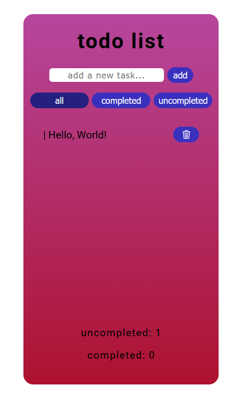

# Todo App (React)


Simple todo list built with React.

## Preview

<p align="center">
  
</p>

## Features

- Add and remove tasks
- Mark tasks as completed
- Filter (all / completed / active)
- localStorage persistence
- Task counters

## Tech Stack

- React (useState, useEffect)
- SCSS
- Vite
- Bootstrap Icons

## Run

```bash
npm install
npm run dev
